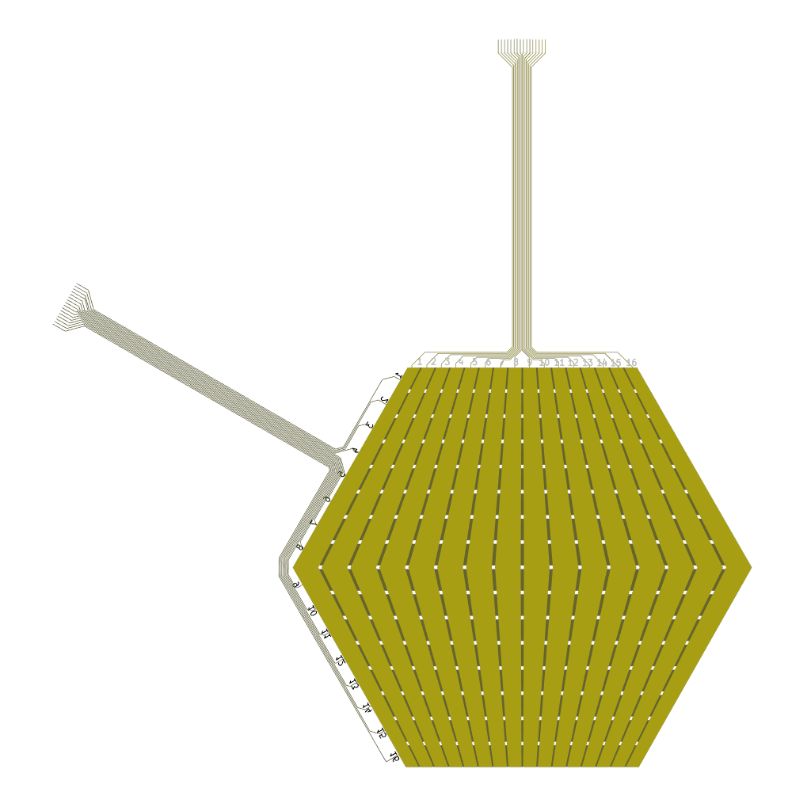
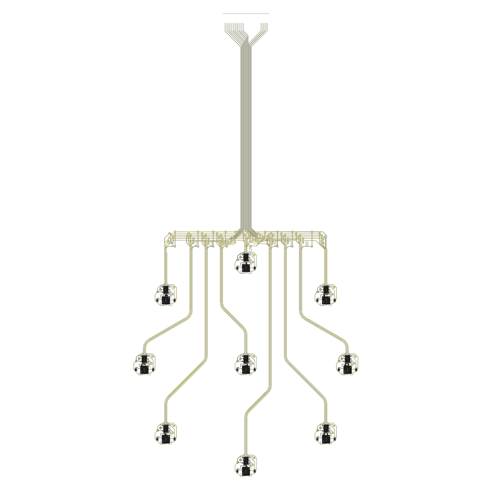
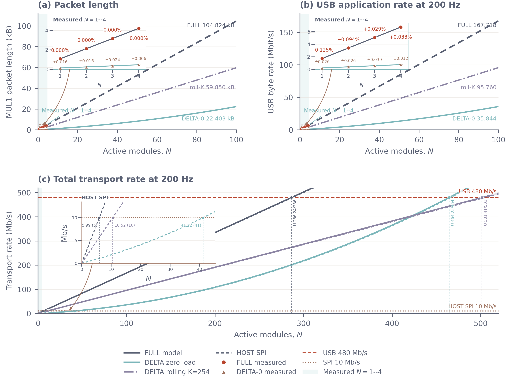
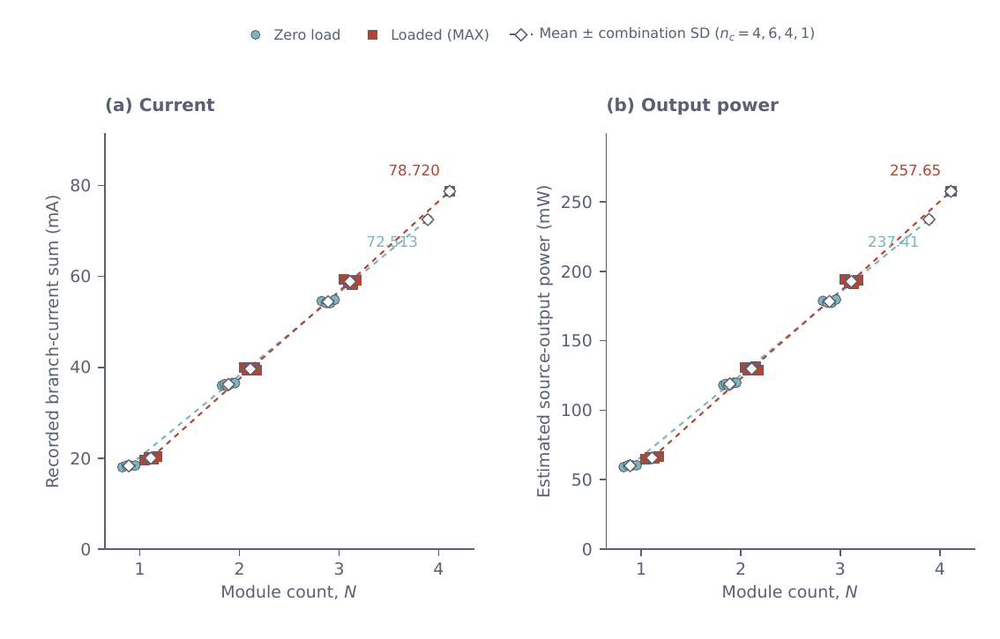
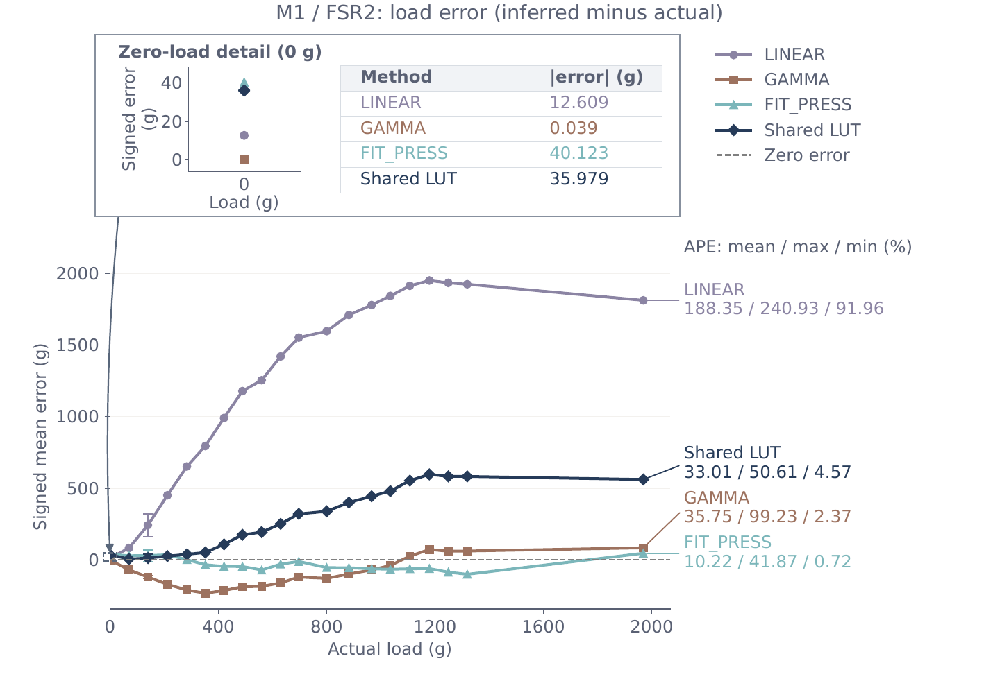

# E-SKIN MSc final report companion

This repository is the evidence package for a modular electronic-skin prototype and its final MSc report. It collects the report-linked experimental records, derived analyses, hardware design evidence and selected figures needed to assess the reported communication, power and calibration results.

## Contents

- [Project background](#project-background)
- [System and data path](#system-and-data-path)
- [Hardware overview](#hardware-overview)
- [Core reported results](#core-reported-results)
- [Repository structure](#repository-structure)
- [Software simulation](#software-simulation)
- [Evidence and reproduction](#evidence-and-reproduction)
- [Scope limits](#scope-limits)

## Project background

The final report treats the E-SKIN prototype as a system-level scalability problem. It starts from an existing modular FSR platform and evaluates whether adding sensing modules remains practical across the complete chain: local acquisition, shared communication, host transport, power delivery and calibration.

### Research gap

Existing e-skin work often foregrounds sensing materials, array geometry or local sensor performance. The report identifies a system-level gap: the available modular prototype had not been evaluated as one connected scaling problem across data traffic, regulated power and calibration repeatability. In particular, the report needed evidence for:

- whether complete FSR data can be transported as modules are added, and whether cached change-driven DELTA frames reduce the same-rate traffic;
- whether the parallel 3.3 V supply maintains the specified voltage range as module count increases, without confusing static readings with a verified transient capacity; and
- whether a layer-wide calibration workflow reduces cell-to-cell variation and reconstructs applied whole-layer mass for separately calibrated FSR layers.

The report separates measured behaviour for N = 1–4 modules from conditional model projections beyond the measured range. The repository follows the same boundary.

### Hypotheses to be tested

The report defines the following hypotheses in its Background chapter. They are listed here as the claims the evidence package is intended to test or bound.

- **D-H1 — protocol-model agreement:** within N = 1–4, observed mean FULL packet lengths and DELTA packet lengths follow the byte budgets using the recorded mask activity, complete-frame incidence and module-update coverage. Values beyond four modules remain conditional extrapolations.
- **D-H2 — DELTA traffic reduction:** change-driven DELTA reduces same-rate packet bytes under the tested activity conditions in windows without detected sequence, cache-chain or target-update anomalies.
- **P-H1 — current prediction:** separately measured single-module currents provide a useful descriptive prediction of the tested multi-module combinations under comparable operating conditions; this is not treated as proof of a universal current-versus-count law.
- **P-H2 — voltage range:** recorded module voltages remain within the project-defined 3.3 V ± 5% band for the tested configurations. Transient delivery and fault-free operation require additional monitoring.
- **C-H1 — spatial dispersion:** with matched RAW inputs and common valid cells, per-cell multi-load fitting reduces spatial dispersion relative to two-point LINEAR or GAMMA calibration, assessed separately using CV, variance, IQR and MAD.
- **C-H2 — mass reconstruction:** per-cell calibration estimates known applied whole-layer mass, quantified with signed bias, absolute error, per-cell MAE/RMSE and non-zero-load percentage error. The report specifies no pass/fail accuracy threshold, so this remains a descriptive error assessment.
- **C-H3 — second-layer repeatability:** applying the same workflow independently to a second nominally identical FSR layer retains the FIT PRESS benefit relative to LINEAR and GAMMA under the same validation procedure. This tests independent retraining across layers, not direct transfer of one fitted model.

The reported results below show which parts are supported by the measured records and which remain model-based or unmeasured.

## System and data path

The report's layered acquisition and communication path is reproduced here for orientation.

[Open the original report flow figure](<Imperial College Individual Project Template_LaTeX/figures/data/data_path_flow.pdf>).

## Hardware overview

The sensing layer places pressure-sensitive resistive foam between opposing copper electrode layers. Orthogonal row and column electrodes form a 16 × 16 matrix; pressure changes the local resistance at each row-column intersection. The STM32 scans the matrix, buffers a complete ESKF or change-driven ESKD frame, and sends it to the Teensy bridge. The mainboard uses an external regulated 3.3 V branch for the module electronics.

The ACC board shown below is an existing prototype interface. It is retained as hardware evidence but is outside the reported FSR performance evaluation.

<table width="100%">
<tr>
<td width="50%" align="center"> Module stack</td>
<td width="50%" align="center"> Rigid mainboard</td>
</tr>
<tr>
<td width="50%" align="center"> Flexible FSR layer</td>
<td width="50%" align="center"> ACC prototype</td>
</tr>
</table>

- [Hardware overview](hardware/README.md)
- [Prototype design records](hardware/prototype/README.md)
- [Shared KiCad libraries and renderings](hardware/libraries/README.md)
- [Active and archived firmware](hardware/firmware/README.md)

## Core reported results

### Communication

- The four-module FULL stream measured 6.747828 ± 0.001148 Mbit/s at the configured 200 Hz scan rate.
- Measured FULL packet lengths matched the protocol model for N = 1–4. Mean USB rates differed from the nominal 200 Hz predictions by +0.029% to +0.125%.
- Extending the FULL model to N = 100 gives 167.7184 Mbit/s; this value is unvalidated because only four modules were measured.
- DELTA reduced same-rate packet bytes by 86.60%–88.73% in zero-load windows and by 65.10%–80.57% in five audited dynamic batches.
- The fitted zero-load ordinary-mask trend is K0(N) = 7.554189 + 0.582684N. The rolling stress projection uses K = 254.
- At 200 Hz, the modelled crossing counts are conditional planning values:

<table width="100%">
<tr>
<th align="left">Traffic model</th>
<th align="right">USB 480 Mbit/s</th>
<th align="right">HOST SPI 10 Mbit/s</th>
</tr>
<tr>
<td>FULL</td>
<td align="right">286 modules</td>
<td align="right">5 modules</td>
</tr>
<tr>
<td>DELTA, zero-load K0(N)</td>
<td align="right">464 modules</td>
<td align="right">41 modules</td>
</tr>
<tr>
<td>DELTA, rolling K = 254</td>
<td align="right">501 modules</td>
<td align="right">10 modules</td>
</tr>
</table>

Only N = 1–4 is experimentally measured. The crossing counts are extrapolations from the reported packet models and interface rates.

[Report source: transport-model validation and capacity projection](<Imperial College Individual Project Template_LaTeX/figures/data/v2_11/full_model_validation.pdf>) · [Communication data and analyses](<data scalability/README.md>)

### Power

The power experiment records static voltage, branch current and temperature readings for all 15 non-empty combinations of M0–M3 under the configured 200 Hz FULL acquisition. The four-module branch-current readings were 72.513 mA and 78.720 mA in the reported branches, and the lowest accepted module minimum was 3.236 V. These static readings do not establish transient supply capacity.

[Report source: continuous-read electrical demand](<Imperial College Individual Project Template_LaTeX/figures/power/v2_9/current_power_scaling.pdf>) · [Power data and analyses](<power scalability/README.md>)

### Calibration

FSR1 and FSR2 were calibrated in separate 22-point sweeps from 0 to 5000 g. In the FSR2 evaluation, FIT PRESS produced a 10.22% mean layer-estimate APE and 171.69 g mean per-cell MAE across 21 validation captures, with a 40.12 g zero-load estimate. The report treats these metrics as comparator- and metric-dependent.

[Report source: FSR2 load reconstruction error](<Imperial College Individual Project Template_LaTeX/figures/calibration/v2_7/fsr2_load_error_vs_load.pdf>) · [Calibration data and analyses](<Calibration scalability/README.md>)

## Repository structure

| Path | Purpose |
|---|---|
| [Calibration scalability](<Calibration scalability>) | FSR1/FSR2 training sweeps, validation captures, calibration models, figures and audits. |
| [data scalability](<data scalability>) | Canonical FULL/DELTA recordings, selected windows, communication models and figures. |
| [power scalability](<power scalability>) | Canonical electrical records, matched photographs, power analyses and figures. |
| [hardware](hardware/README.md) | Prototype design files, manufacturing exports, shared libraries, renderings and firmware. |
| [LaTeX supplementary package](<Imperial College Individual Project Template_LaTeX/figures>) | Report-linked figures and [audit evidence](<Imperial College Individual Project Template_LaTeX/audit>). |
| [README assets](README_assets) | Rendered copies of the core report result figures used by this README; the data-path rendering is stored with firmware. |
| [figure_style.py](figure_style.py) | Shared plotting-style helper retained with the evidence package. |

The complete report source, build outputs and report-version archive are intentionally ignored by Git. The report remains the reference document; this repository publishes the supporting records and selected supplementary material rather than a standalone report compiler.

## Evidence and reproduction

Raw records are retained as recorded in the three scalability packages. Derived tables and figures identify their input manifests and analysis directories. Scripts use portable relative paths within the organized packages; machine-specific build products, caches, live captures and temporary review files are ignored.

The audit material records provenance and validation checks for report-linked data. It does not introduce additional experiments or replace the report's stated methods.

## Scope limits

- Communication measurements stop at four modules; larger module counts are conditional projections.
- Power results are static readings and do not establish transient supply capacity.
- Cross-module calibration, calibration transfer between layers and repeatability after reassembly were not measured.
- The ACC prototype is documented as hardware evidence but is outside the reported FSR evaluation.

## Software simulation

The early software simulator is maintained in the separate [e-skin-simulator repository](https://github.com/Yannas-Sun/e-skin-simulator). It explores module geometry, FSR and accelerometer readout, protocol traffic and visualisation before all hardware paths are complete.

The simulator is an initial design and communication tool. It is not evidence for the measured report results and is not a high-fidelity electrical, mechanical or finite-element model. Scan strategies, MCU-in-the-loop behaviour, event-driven sensing, multi-patch communication and physical validation still require further development.
