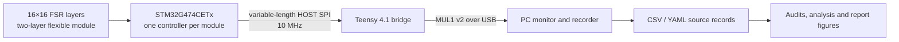

# E-SKIN MSc final report evidence

This repository is the release package for a modular electronic-skin prototype and the final MSc report. The project studies how sensing data, power demand and calibration quality scale when several flexible force-sensing modules share one readout system.

## System background

Each module contains two 16×16 flexible FSR electrode layers and an STM32G474CETx sensing controller. Up to four modules are selected by a Teensy 4.1 host bridge. The bridge clocks variable-length module frames over a 10 MHz HOST SPI link, wraps them in MUL1 v2 packets and forwards them to the PC over USB.

The communication study compares complete ESKF FULL frames with change-driven ESKD DELTA frames at a configured 200 Hz scan rate. The reported measurements cover N=1–4 modules. Extensions beyond four modules are model-based planning projections, not additional hardware measurements. The power study reports static voltage, current and temperature readings for all 15 non-empty module combinations. The calibration study uses separate 22-point, 0–5000 g sweeps for FSR1 and FSR2.

## Hardware and data flow

| Module rendering | Mainboard | FSR array |
|---|---|---|
|  |  |  |

## Repository map

- Calibration scalability/: FSR training sweeps, validation captures, models and audits.
- data scalability/: canonical FULL/DELTA recordings, selections and communication analyses.
- power scalability/: canonical electrical records, photographs, retests and power analyses.
- hardware/: prototype design files, manufacturing outputs, shared KiCad libraries and active firmware.
- Imperial College Individual Project Template_LaTeX/: report-linked figures, audit tables and the final PDF archive.

The reviewed report PDF is maintained locally at `Imperial College Individual Project Template_LaTeX/report_versions/main_final.pdf`; that report archive, full LaTeX source and build outputs are excluded by `.gitignore`. This repository publishes the report-linked evidence and supplementary figures.

## Evidence boundaries

- Communication: 114 indexed recordings; the report selects 45 FULL zero-load windows, 45 DELTA zero-load windows and 15 DELTA dynamic windows.
- Power: 15 non-empty module combinations under configured 200 Hz FULL acquisition; readings are static descriptions.
- Calibration: independent FSR1 and FSR2 training and validation datasets; validation records are separate from training sweeps.

Raw records are retained as recorded. Derived tables and figures identify their input manifests and analysis directories. Historical material remains in archive, history or reference folders when it is needed for provenance.
