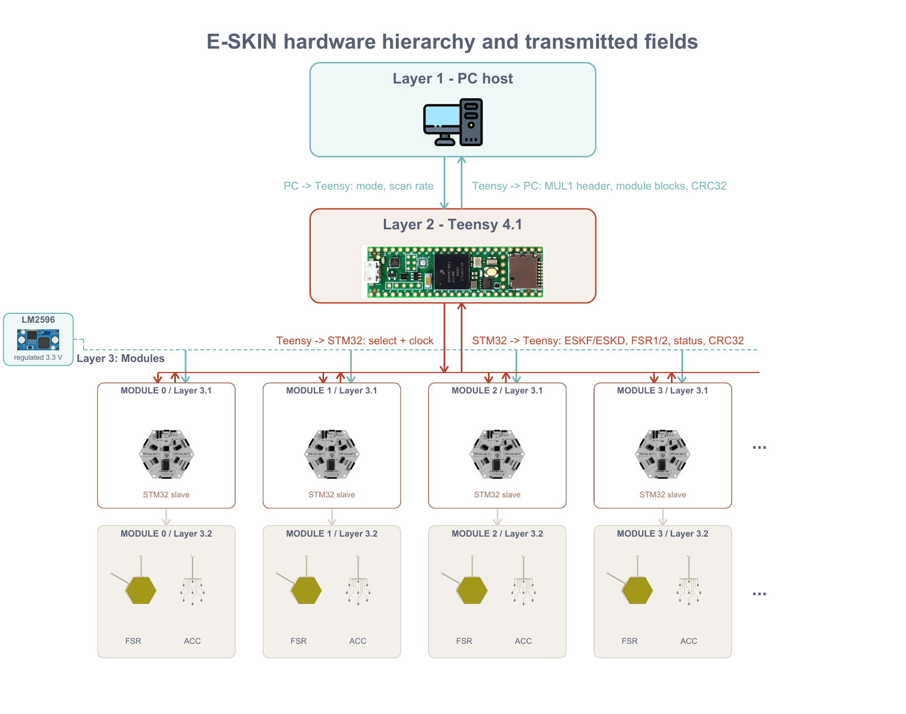

# E-SKIN MSc final report companion

This repository is the evidence package for a modular electronic-skin prototype and its final MSc report. It collects the report-linked experimental records, derived analyses, hardware design evidence and selected figures needed to assess the reported communication, power and calibration results.

## Contents

- [Project background](#project-background)
- [System and data path](#system-and-data-path)
- [Core reported results](#core-reported-results)
- [Hardware overview](#hardware-overview)
- [Repository structure](#repository-structure)
- [Evidence and reproduction](#evidence-and-reproduction)
- [Scope limits](#scope-limits)

## Project background

The system is a four-module force-sensing prototype. Each module uses two replaceable flexible FSR electrode layers and a local STM32G474CETx controller. A rigid four-layer mainboard provides the FSR connections, readout electronics, power distribution, programming access and host connector. A Teensy 4.1 host bridge selects modules, receives variable-length frames over a 10 MHz HOST SPI link, assembles MUL1 v2 packets and forwards them to the PC over USB.

The report evaluates three linked questions:

1. How communication traffic scales with module count under complete ESKF FULL frames and change-driven ESKD DELTA frames.
2. How static branch current, voltage and temperature readings change across the 15 non-empty module combinations.
3. How separately trained FSR1 and FSR2 layers perform under the reported loading and validation procedures.

The measured communication and power records cover one to four modules. Values beyond four modules are model-based planning projections and are labelled as such below.

## System and data path

The report's layered acquisition and communication path is reproduced here for orientation.

[Open the original report flow figure](<Imperial College Individual Project Template_LaTeX/figures/data/data_path_flow.pdf>).

## Core reported results

### Communication

- The four-module FULL stream measured 6.747828 ± 0.001148 Mbit/s at the configured 200 Hz scan rate.
- Measured FULL packet lengths matched the protocol model for N = 1–4. Mean USB rates differed from the nominal 200 Hz predictions by +0.029% to +0.125%.
- Extending the FULL model to N = 100 gives 167.7184 Mbit/s; this value is unvalidated because only four modules were measured.
- DELTA reduced same-rate packet bytes by 86.60%–88.73% in zero-load windows and by 65.10%–80.57% in five audited dynamic batches.
- The fitted zero-load ordinary-mask trend is K0(N) = 7.554189 + 0.582684N. The rolling stress projection uses K = 254.
- At 200 Hz, the modelled crossing counts are conditional planning values:

| Traffic model | USB 480 Mbit/s | HOST SPI 10 Mbit/s |
|---|---:|---:|
| FULL | 286 modules | 5 modules |
| DELTA, zero-load K0(N) | 464 modules | 41 modules |
| DELTA, rolling K = 254 | 501 modules | 10 modules |

Only N = 1–4 is experimentally measured. The crossing counts are extrapolations from the reported packet models and interface rates.

[Communication data and analyses](<data scalability/README.md>) · [Communication figures](<data scalability/figures/exports>)

### Power

The power experiment records static voltage, branch current and temperature readings for all 15 non-empty combinations of M0–M3 under the configured 200 Hz FULL acquisition. The four-module branch-current readings were 72.513 mA and 78.720 mA in the reported branches, and the lowest accepted module minimum was 3.236 V. These static readings do not establish transient supply capacity.

[Power data and analyses](<power scalability/README.md>) · [Power figures](<power scalability/DATA/analysis/current/report_v2_8_figures>)

### Calibration

FSR1 and FSR2 were calibrated in separate 22-point sweeps from 0 to 5000 g. In the FSR2 evaluation, FIT PRESS produced a 10.22% mean layer-estimate APE and 171.69 g mean per-cell MAE across 21 validation captures, with a 40.12 g zero-load estimate. The report treats these metrics as comparator- and metric-dependent.

[Calibration data and analyses](<Calibration scalability/README.md>) · [Calibration figures](<Calibration scalability/paper_figures>)

## Hardware overview

The sensing layer places pressure-sensitive resistive foam between opposing copper electrode layers. Orthogonal row and column electrodes form a 16 × 16 matrix; pressure changes the local resistance at each row-column intersection. The STM32 scans the matrix, buffers a complete ESKF or change-driven ESKD frame, and sends it to the Teensy bridge. The mainboard uses an external regulated 3.3 V branch for the module electronics.

The ACC board shown below is an existing prototype interface. It is retained as hardware evidence but is outside the reported FSR performance evaluation.

<table>
<tr>
<td> Module stack</td>
<td> Rigid mainboard</td>
</tr>
<tr>
<td> Flexible FSR layer</td>
<td> ACC prototype</td>
</tr>
</table>

- [Hardware overview](hardware/README.md)
- [Prototype design records](hardware/prototype/README.md)
- [Shared KiCad libraries and renderings](hardware/libraries/README.md)
- [Active and archived firmware](hardware/firmware/README.md)

## Repository structure

| Path | Purpose |
|---|---|
| [Calibration scalability](<Calibration scalability>) | FSR1/FSR2 training sweeps, validation captures, calibration models, figures and audits. |
| [data scalability](<data scalability>) | Canonical FULL/DELTA recordings, selected windows, communication models and figures. |
| [power scalability](<power scalability>) | Canonical electrical records, matched photographs, power analyses and figures. |
| [hardware](hardware/README.md) | Prototype design files, manufacturing exports, shared libraries, renderings and firmware. |
| [LaTeX supplementary package](<Imperial College Individual Project Template_LaTeX/figures>) | Report-linked figures and [audit evidence](<Imperial College Individual Project Template_LaTeX/audit>). |
| [README assets](README_assets) | Rendered copy of the report data-path figure used by this README. |
| [figure_style.py](figure_style.py) | Shared plotting-style helper retained with the evidence package. |

The complete report source, build outputs and report-version archive are intentionally ignored by Git. The report remains the reference document; this repository publishes the supporting records and selected supplementary material rather than a standalone report compiler.

## Evidence and reproduction

Raw records are retained as recorded in the three scalability packages. Derived tables and figures identify their input manifests and analysis directories. Scripts use portable relative paths within the organized packages; machine-specific build products, caches, live captures and temporary review files are ignored.

The audit material records provenance and validation checks for report-linked data. It does not introduce additional experiments or replace the report's stated methods.

## Scope limits

- Communication measurements stop at four modules; larger module counts are conditional projections.
- Power results are static readings and do not establish transient supply capacity.
- Cross-module calibration, calibration transfer between layers and repeatability after reassembly were not measured.
- The ACC prototype is documented as hardware evidence but is outside the reported FSR evaluation.