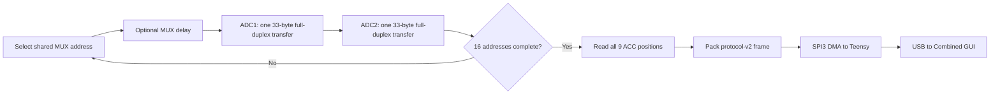

# Legacy SCLK scan reproduction — 2026-08-11

## Outcome so far

The pre-experiment firmware state was preserved first on GitHub branch
`firmware-integration-20260810` as commit
[`9291d8b`](https://github.com/Yannas-Sun/e-skin-simulator/commit/9291d8b1b252e4b205048d8c27349f615487a6a9),
`Checkpoint fresh full-scan acquisition experiments`.

An isolated STM32 variant now reproduces the old Teensy 33-byte SCLK-driven
MAX11633 scan. The normal application and its two existing deployment commands
remain unchanged. All three profiles compile successfully in Release mode.
The staged hardware test then established a clear boundary:

- `safe2p5` produced coherent nonzero data from both FSR arrays at about
  138.4 complete frames/s with zero transport errors in the initial 20-second
  capture;
- `legacy10_settle100` raised the rate to about 229.2 frames/s, but the raw ADC
  code distribution collapsed to a small set of bit-boundary values, so it
  failed data integrity even though transport had no tracked error and every
  sampled CRC check passed;
- zero-settle `legacy10` was not run because the clock-only 10 MHz stage had
  already failed;
- the STM32 was restored with the unchanged normal `flash_combined.cmd`, and a
  10-second recovery capture returned to 238.333 frames/s with zero transport
  errors.

> 中文：旧版 33 字节扫描方式已经复刻成功；2.5 MHz 下数据与传输均正常。
> 10 MHz 虽然更快、CRC 抽检也均通过，但 ADC 原始数值已经明显失真，因此不能用。
> 这说明“SPI 帧正确”不等于“ADC 转换正确”。设备最后已恢复到原完整扫描固件。

## Separation from the current firmware

```text
Stable/current source
  stm32/applications/combined_system/
  tools/commands/flash_combined_pair.cmd
                  (unchanged)

Experimental source
  stm32/experiments/combined_system_sclk33/
  tools/commands/flash_combined_sclk33_experiment.cmd
                  (new and independent)
```

The experimental CMake target reuses the present board startup, GPIO mapping,
ACC acquisition, protocol v2 packing, periodic CRC, SPI3 DMA ping-pong
transport, Teensy bridge and GUI. It replaces only the acquisition translation
unit. This isolates the effect of the MAX11633/MUX scan method.

## Reproduced transaction

For each MUX address and each ADC, CS remains low for exactly 33 bytes:

```text
86 00 8E 00 96 00 9E 00 A6 00 AE 00 B6 00 BE 00
C6 00 CE 00 D6 00 DE 00 E6 00 EE 00 F6 00 FE 00 00
```

`0x86` starts AIN0 in no-scan mode. While the two result bytes for one channel
are shifted out, the even TX positions start the next channel. Sixteen values
are decoded from `RX[1..32]`; `RX[0]` is deliberately discarded. EOC is not
polled because SCLK drives conversion.



The two ADC transfers remain sequential because ADC1 and ADC2 share SPI1 MISO.
At 10 MHz, the two-ADC, 16-address wire-only minimum is:

```text
33 bytes * 2 ADCs * 16 addresses * 8 / 10 MHz = 844.8 us
```

Every reproduction frame sets reserved status bit `0x20` so a capture can be
distinguished from the normal acquisition build. The existing receivers do
not reject unknown upper status bits; FSR validity remains in bits `0x01/0x02`
and CRC presence remains in `0x10`.

## One intentional difference from the old source

The old Teensy setup byte was `0x78`, which selected SCLK conversion and the
internal reference. Mainboard 2.2 physically ties both ADC REF pins to the
external 3.3 V rail. The reproduction therefore uses `0x74`: identical SCLK
conversion mode, but the correct external-reference selection. Sending the old
internal-reference setting onto this board would not be a safe comparison.
The old `0x31` averaging-register byte is retained. It sets AVGON, but the data
sheet specifies that clock mode 11 disables averaging, so it does not multiply
the conversions in this experiment.

## Profiles and complete commands

| Profile | ADC SPI1 | MUX delay | Purpose |
|---|---:|---:|---|
| `safe2p5` | 2.5 MHz | 100 us | Initial functional PASS; long pressure/mapping test remains |
| `legacy10_settle100` | 10 MHz | 100 us | FAIL: faster transport, corrupted/quantised ADC codes |
| `legacy10` | 10 MHz | 0 us | Compiles, but hardware test skipped after the clock-only failure |

The commands are retained for reproducibility. For any new run, start with
`safe2p5` only. The recorded 10 MHz clock-only test already failed ADC-data
acceptance, so neither 10 MHz command should be run as part of an automatic
sequence:

```powershell
& "D:\study\programming\ESKIN\firmware\tools\commands\flash_combined_sclk33_experiment.cmd" COM9 safe2p5 all
```

For a deliberate reproduction only, the known-failed 10 MHz profiles require
the exact fourth-argument confirmation token and are kept in a separate block:

```powershell
& "D:\study\programming\ESKIN\firmware\tools\commands\flash_combined_sclk33_experiment.cmd" COM9 legacy10_settle100 all I_ACCEPT_OUT_OF_SPEC_10MHZ
& "D:\study\programming\ESKIN\firmware\tools\commands\flash_combined_sclk33_experiment.cmd" COM9 legacy10 all I_ACCEPT_OUT_OF_SPEC_10MHZ
```

Each authorized command builds and flashes the isolated STM32 image, uploads
the existing Teensy combined bridge, waits for COM9 and opens the GUI. The
default profile, when omitted, is `safe2p5`. On normal GUI exit or on a
post-flash Teensy/GUI failure, the wrapper prints the active experiment state
and the exact rollback command.

After the recorded tests, the board was restored to the normal current
full-scan firmware. Running an experiment command changes that state and must
be followed by the rollback command below.

Restore the current non-reproduction firmware with the original command:

```powershell
& "D:\study\programming\ESKIN\firmware\tools\commands\flash_combined_pair.cmd" COM9
```

## Build verification

| Target | Result | RAM | Flash |
|---|---|---:|---:|
| Current `combined_system`, Release | PASS | 9,096 B | 15,128 B |
| SCLK33 `safe2p5`, Release | PASS | 9,104 B | 14,648 B |
| SCLK33 `legacy10_settle100`, Release | PASS | 9,104 B | 14,648 B |
| SCLK33 `legacy10`, Release | PASS | 9,104 B | 14,616 B |
| Existing Teensy combined bridge | PASS | RAM1 variables 28,256 B | code 40,588 B |

The pre-existing unused-function warnings in `main.c` remain; the SCLK33
translation unit adds no compiler warning.

## Hardware results

| Profile/state | Diagnostic rate | Parsed rate | Median FSR time | Transport | ADC data conclusion |
|---|---:|---:|---:|---|---|
| `safe2p5` | 138.677 Hz | 138.392 Hz | 6,745 us | 2,635/2,635; all tracked errors 0 | Initial PASS; FSR1 `0..2433`, FSR2 `0..1199` |
| `legacy10_settle100` | 229.660 Hz | 229.210 Hz | 3,883 us | 4,364/4,364; all tracked errors 0 | FAIL; only 44/55 recent unique FSR1/FSR2 codes |
| Restored normal build | 238.333 Hz | not re-parsed | normal full-scan path | 2,145/2,145; all tracked errors 0 | Recovery PASS |

Evidence:

- [`safe2p5` initial capture](../../test_results/20260811_121302_sclk33_safe2p5_attempt1.txt)
- [`legacy10_settle100` capture](../../test_results/20260811_121550_sclk33_legacy10_settle100_attempt2.txt)
- [post-experiment normal-firmware recovery](../../test_results/20260811_121847_post_sclk33_restore_fullscan.txt)

Independent parsing found 2,773 and 4,593 consecutive experiment frames,
respectively, with zero rejected candidates, zero sequence gaps, experiment
flag `0x20` on every frame, both FSR validity bits set, and exactly 16 updated
MUX addresses reported on every frame.

The decisive failure is in the sensor values, not the digital link. In the
last 200 frames, `safe2p5` produced 407 unique FSR1 codes and 638 unique FSR2
codes. At 10 MHz this collapsed to 44 and 55, with heavy concentration at
`7, 15, 63, 127, 255, 511, 1023` and related bit-boundary values. CRC remains
correct because the STM32 faithfully packs the already-wrong ADC results and
then calculates CRC over those bytes; CRC cannot validate the analogue
conversion that occurred before packet construction.

## Hardware acceptance sequence

1. **Initial `safe2p5` stream check: PASS.** Both FSR matrices were nonzero,
   transport was continuous, and all 16 addresses were updated.
2. **Long pressure/mapping acceptance: pending.** Apply controlled presses and
   capture at least 30 seconds before treating `safe2p5` as fully validated.
3. **`legacy10_settle100`: FAIL.** The isolated clock change corrupted ADC
   codes, despite zero packet-level errors.
4. **`legacy10`: skipped.** Removing MUX settling cannot repair a clock-mode
   failure and would add another variable.
5. **Logic-analyser verification: pending.** Each ADC CS-low interval should
   contain 264 SCK edges and the MOSI sequence above.
6. **Rollback: PASS.** The unchanged normal flash script restored the current
   full-scan image and the recovery capture returned to 238.333 Hz.

The [MAX11633 data sheet](https://www.analog.com/media/en/technical-documentation/data-sheets/MAX11626-MAX11633.pdf)
specifies the external conversion clock up to 4.8 MHz. Therefore both
`legacy10*` profiles are deliberately out-of-spec. A fast GUI alone is not a
pass: speed, channel alignment, pressure response, crosstalk and long-run error
counters must all be checked.
