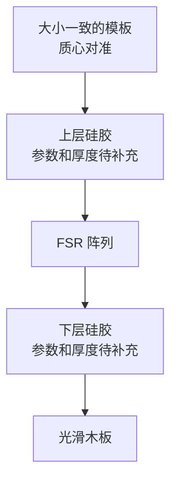
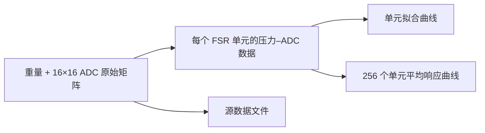

# FSR 压力–ADC 校准方法

## 1. 为什么校准对可拓展性重要

FSR 由本项目自行设计、制造和拼装。每个模块中的每个 FSR 都存在物理特性差异，需要分别校准。

六边形单元的面积不同，承受的压强和自身电阻特性也不同，因此各单元会产生响应差异和零点漂移。

每个模块包含两层 $16\times16$ FSR 阵列，共 512 个单元。模块数量增加后，逐个单元校准的时间和成本会迅速上升，因此需要一种快速、准确且可重复的校准方法，使模块重新组装或重启后不需要频繁重新校准。

多模块扩展需要重复组装，FFC 可能频繁插拔，模块也可能断电重启，需要检测这些情况是否会导致重新校准。

校准用于统一：

- 单元基线与增益；
- 压力–ADC 映射；
- 不同模块的数据格式与参数。

> 备注：本项目重点是可拓展性，暂不研究不同传感器、硅胶硬度、层间距离和剪切力的影响。当前实验对两层 FSR 分别进行测试，不将两层组装为一个整体。

## 2. 校准方法

### 2.1 校准结构

| 部件 | 放置或使用方式 |
|---|---|
| 硅胶层 | FSR 上、下各放置一层；参数和厚度后续补充 |
| FSR | 放置在两块光滑木板的正中心 
| 木板 | 使用高刚性、表面平整且质量分布均匀的木板；上下平行，保证受力均匀 |
| 模板 | 大小一致，每次增加时质心位置保持一致 |

整个结构放置在木板中心，模板的中心线与 FSR 阵列中心对准。

### 2.2 数据采集流程

| 步骤 | 操作 | 记录内容 |
|---:|---|---|
| 1 | 以无模板状态作为起始状态 | 当前重量、全部 FSR 单元 ADC 值 |
| 2 | 在质心位置加入一个模板 | 当前总重量、全部 FSR 单元 ADC 值 |
| 3 | 重复加入大小一致的模板 | 每次当前总重量、全部 FSR 单元 ADC 值 |
| 4 | 继续采集，直到总重量达到 5000 g | 最后一组重量和全部单元读数 |

每次采集保存一个完整的 `16 × 16` FSR 读数矩阵，并将重量与该矩阵对应保存。

### 2.3 输出结果

需要生成：

- 每个 FSR 单元的压力–ADC 原始数据图；
- 每个 FSR 单元的拟合曲线图；
- 所有 FSR 单元平均 ADC 读数与压力的折线图；
- 所有 FSR 单元平均响应的拟合曲线图；
- 本次采集的源数据文件。

### 2.4 拟合方法

对每个 FSR 单元分别使用采集到的压力–ADC 数据进行单调 PCHIP 插值，并生成 LUT：

- PCHIP 保留实测点之间的非线性响应；
- 单调约束避免拟合曲线出现不合理反向波动；
- LUT 用于后续将 ADC 读数转换为压力值。

### 2.5 后续计算

#### 2.5.1 FSR 单元压强

根据 PCB 几何尺寸计算每个 FSR 单元扣除间隙后的有效面积 $A_i$。载荷换算为力后，使用单元有效面积计算压强：

\[
P_i = \frac{F_i}{A_i}
\]

其中：

- $P_i$：第 $i$ 个 FSR 单元的压强；
- $F_i$：分配到第 $i$ 个单元的力；
- $A_i$：第 $i$ 个单元的有效面积。

#### 2.5.2 ADC 值换算为 FSR 电阻

对于当前下拉电阻分压结构：

\[
V_{ADC}=V_{ref}\frac{ADC}{2^n-1}
\]

\[
R_{FSR}=R_{pull}\left(\frac{V_{CC}}{V_{ADC}}-1\right)
\]

其中 $R_{pull}$ 为下拉电阻，$n$ 为 ADC 位数。

## 3. Evaluation

### 3.1 单元方差是否降低

使用未参与校准的验证载荷进行测试。验证载荷包含不同重量，且不与校准时使用的重量重复。在相同载荷下，比较校准前后所有 FSR 单元读数的离散程度。

对第 $j$ 个载荷，设第 $i$ 个单元的读数为 $x_{i,j}$，单元总数为 $N$：

\[
\bar{x}_j=\frac{1}{N}\sum_{i=1}^{N}x_{i,j}
\]

\[
s_j^2=\frac{1}{N-1}\sum_{i=1}^{N}(x_{i,j}-\bar{x}_j)^2
\]

校准前后的方差降低比例为：

\[
\text{Variance Reduction}_j
=\left(1-\frac{s_{j,\,after}^{2}}{s_{j,\,before}^{2}}\right)\times100\%
\]

方差降低比例越高，说明校准后各单元在相同载荷下越一致。

### 3.2 反推压力与实际压力对比

使用校准曲线将 ADC 读数反推出压力，并与已知载荷计算得到的实际压力比较，以确认校准曲线是否准确。

实际压力：

\[
P_{actual}=\frac{F}{A}
=\frac{m\,g}{A}
\]

校准曲线反推出的压力：

\[
P_{estimated,i}=f_i(ADC_i)
\]

其中 $f_i$ 为第 $i$ 个 FSR 单元的 PCHIP/LUT 校准映射。压力误差为：

\[
e_i=P_{estimated,i}-P_{actual}
\]

相对误差为：

\[
e_{relative,i}
=\frac{|P_{estimated,i}-P_{actual}|}{P_{actual}}\times100\%
\]

比较不同验证载荷下的压力误差，确认每个 FSR 单元的校准曲线能否正确反映实际压力。
