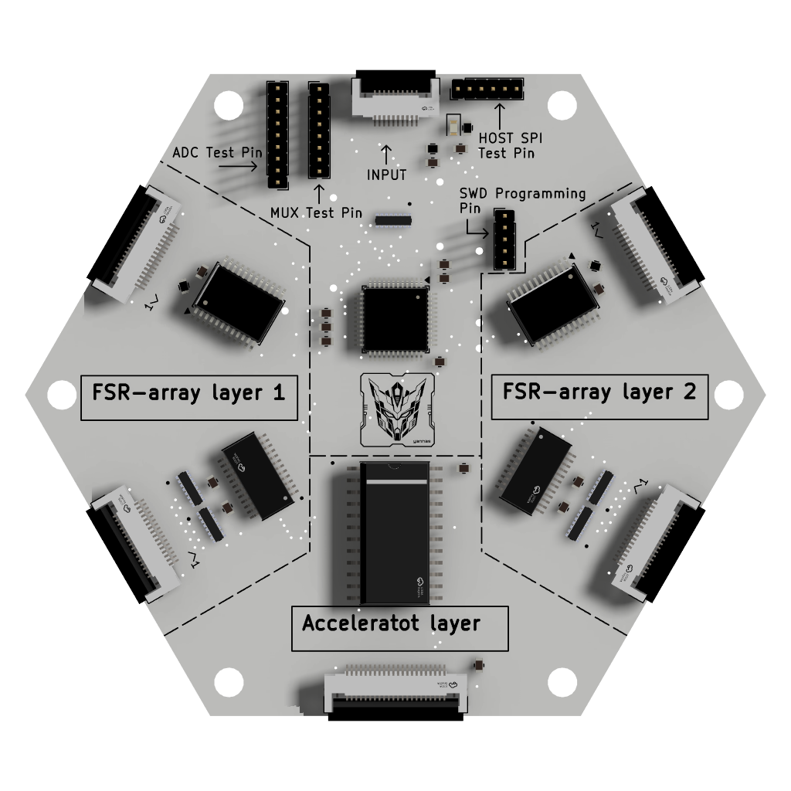

# Prototype design records

This directory contains the current KiCad design and manufacturing records for the evaluated mainboard and flexible FSR layers, plus the ACC prototype interface.

## Hardware principles

- The [mainboard](mainboard/README.md) is a four-layer rigid FR4 controller board with local STM32G474CETx acquisition, FSR readout, branch power distribution, connectors and programming access.
- The [flexible FSR array](fsr_array/README.md) is a passive two-layer electrode carrier. Orthogonal row and column electrodes surround a pressure-sensitive resistive foam layer to form a 16 x 16 matrix.
- The [ACC prototype](acc_prototype/README.md) is an existing accelerometer interface retained as hardware evidence; it is outside the reported FSR evaluation.

Each board directory separates design files from manufacturing exports. The renderings below are orientation images; the KiCad projects and Gerbers are the source records.

## Renderings

<table>
<tr>
<td> Module stack</td>
<td> Rigid mainboard</td>
</tr>
<tr>
<td> Flexible FSR layer</td>
<td> ACC prototype</td>
</tr>
</table>

## Contents

- [mainboard/](mainboard/README.md): rigid controller schematic, PCB layout, BOM and manufacturing files.
- [fsr_array/](fsr_array/README.md): flexible FSR schematic, PCB layout and manufacturing files.
- [acc_prototype/](acc_prototype/README.md): ACC prototype schematic, PCB layout, BOM and manufacturing files.
- renderings/: small reference images used by this README.

Open each KiCad project from its design directory with the shared libraries available under hardware/libraries/.