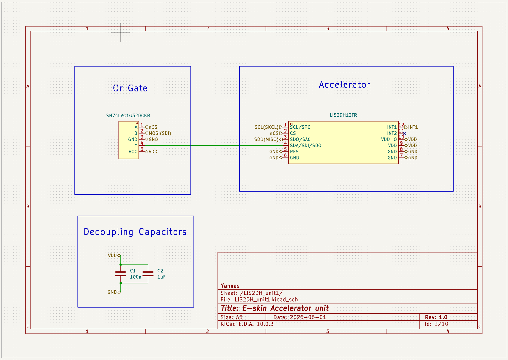
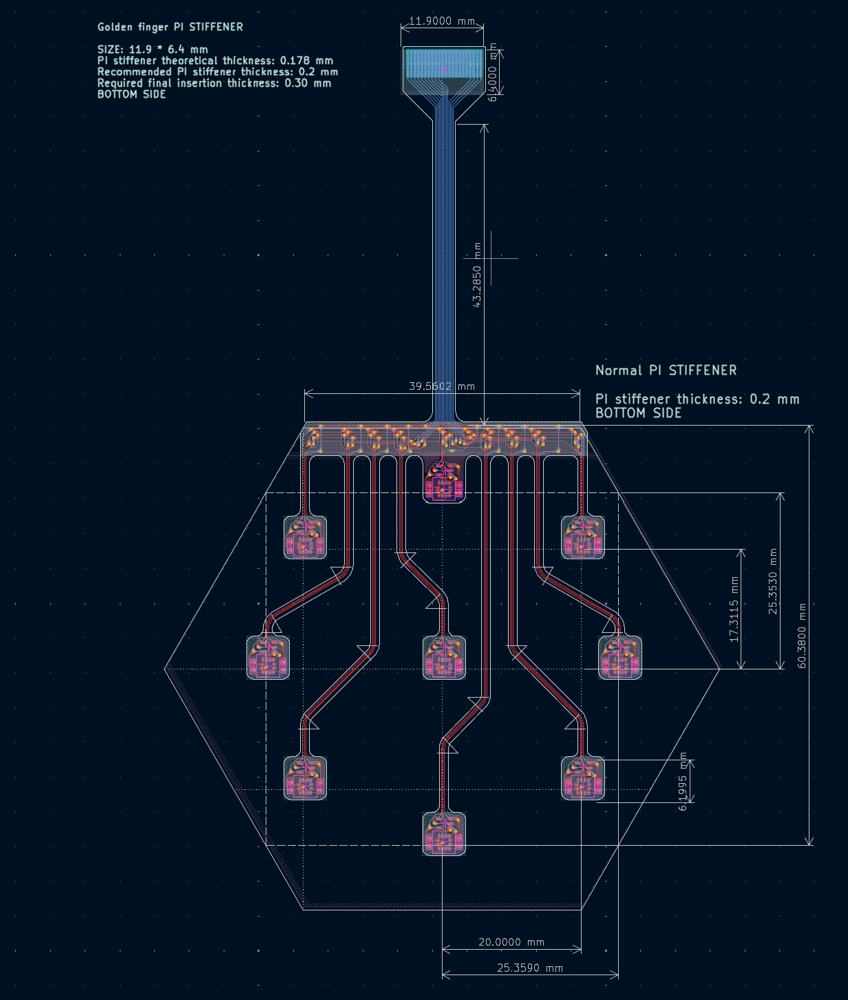
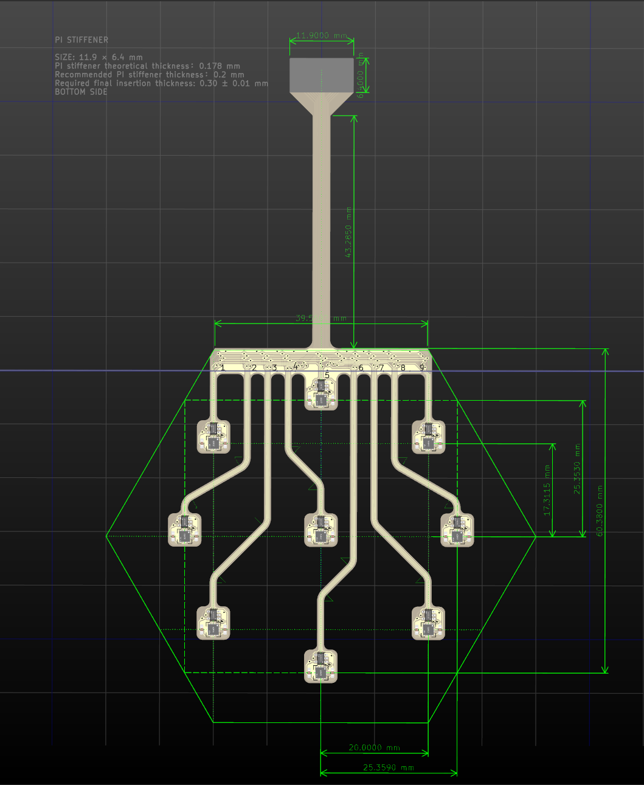
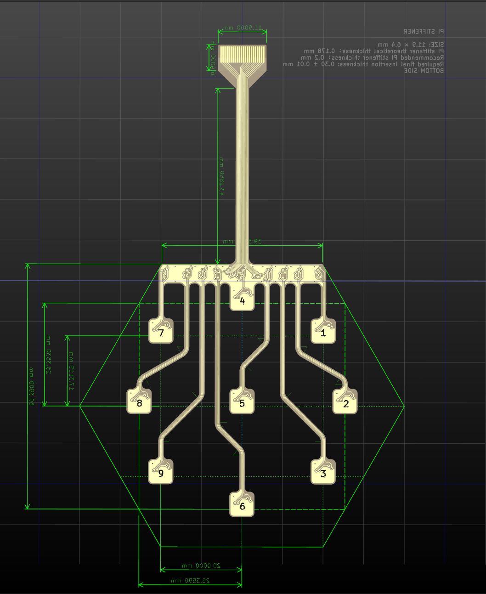

# ACC prototype interface

This directory contains the flexible accelerometer interface retained as a hardware prototype record. It is outside the reported FSR performance evaluation.

## Hardware principle

The ACC layer places accelerometer devices on a flexible carrier and routes their local logic and supply connections to an FFC tail. The current manufacturing BOM lists nine LIS2DH12TR accelerometers. Each sensor is paired with local 100 nF and 1 uF decoupling, and SN74LVC1G32DCKR logic gates provide the interface logic shown in the unit schematics.

The mainboard ACC connector and CD74HC154M96 decoder provide the module-side interface. These records document the existing prototype; no ACC measurements are included in the report results.

## Hardware views

### Rendering

### Schematic

### PCB layout

### Fabricated board views

<table>
<tr>
<td> Front</td>
<td> Bottom</td>
</tr>
</table>

## Principal components

| Function | Part or record | Quantity |
|---|---|---:|
| Accelerometer | LIS2DH12TR | 9 |
| Interface logic | SN74LVC1G32DCKR | 9 |
| Local decoupling | 100 nF capacitors | 9 |
| Local decoupling | 1 uF capacitors | 9 |
| Flexible tail connector | AFC01-S22FCA-00_FPC_TAIL | 1 |

The design directory also retains LIS2DH and LIS3DH unit-level schematic records. The manufacturing BOM identifies LIS2DH12TR as the populated accelerometer.

## Design and manufacturing records

- [KiCad project](design/ACC.kicad_pro)
- [ACC schematic source](design/ACC.kicad_sch)
- [PCB source](design/ACC.kicad_pcb)
- [LIS2DH unit schematic](design/LIS2DH_unit1.kicad_sch)
- [LIS3DH unit schematic](design/LIS3DH_unit1.kicad_sch)
- [BOM](manufacturing/gerber/ACC.csv)
- [Gerber archive](manufacturing/gerber.zip)
- [Gerber files](manufacturing/gerber)

## Component references

- [LIS2DH12 datasheet](../../libraries/datasheet/ACC/ACC%20(LIS2DH12).pdf)
- [LIS3DH datasheet](../../libraries/datasheet/ACC/ACC%20(LIS3DH).pdf)
- [SN74LVC1G32DCKR datasheet](../../libraries/datasheet/ACC/OR%20GATE%20(SN74LVC1G32DCKR).pdf)
- [AFC01-S22FCA-00 connector datasheet](../../libraries/datasheet/ACC/CONNECTOR%20(AFC01-S22FCA-00).pdf)