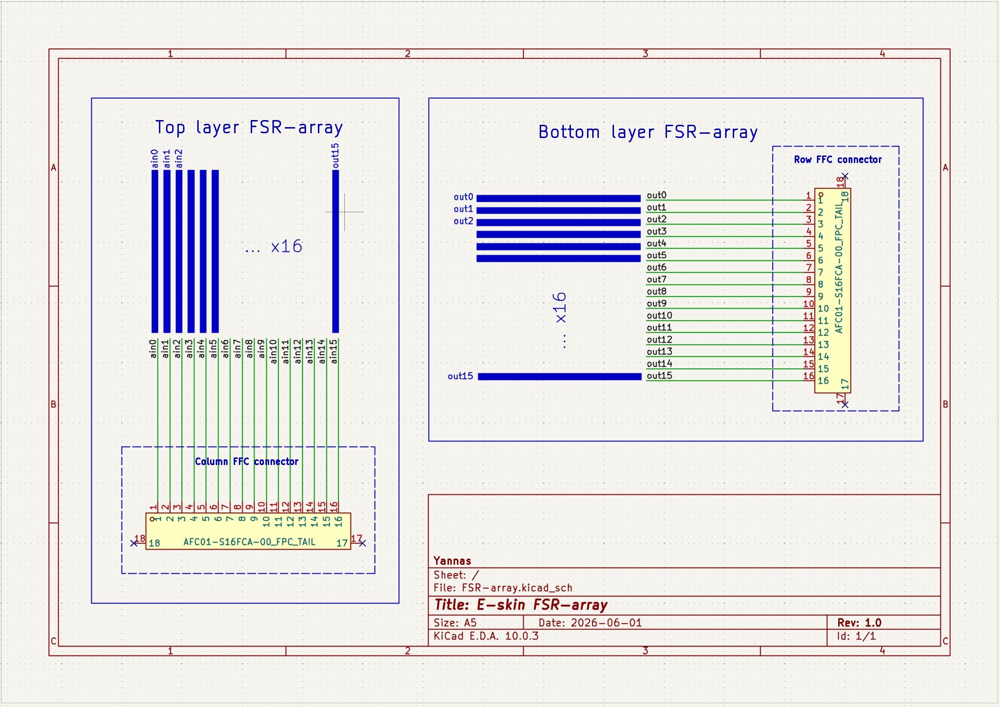
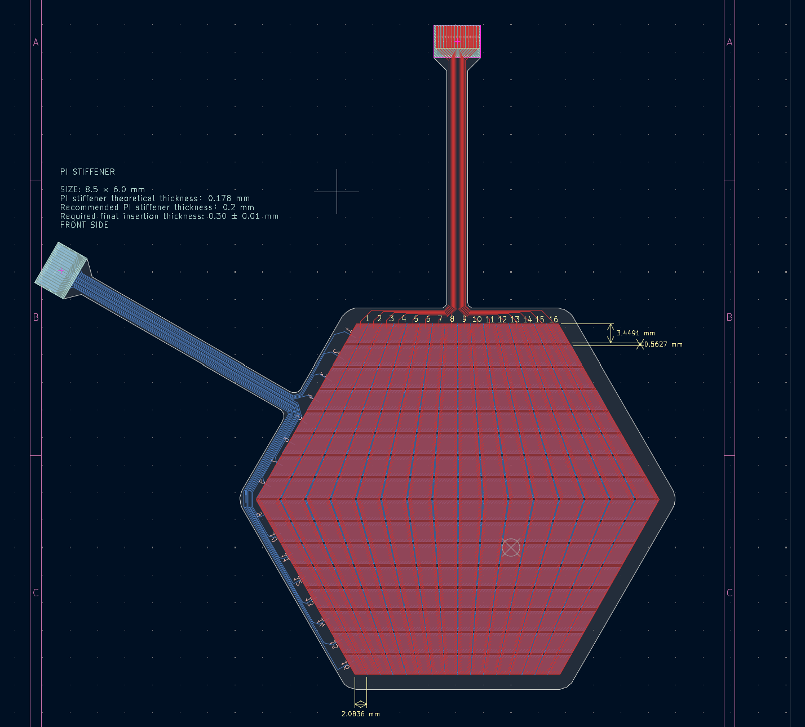
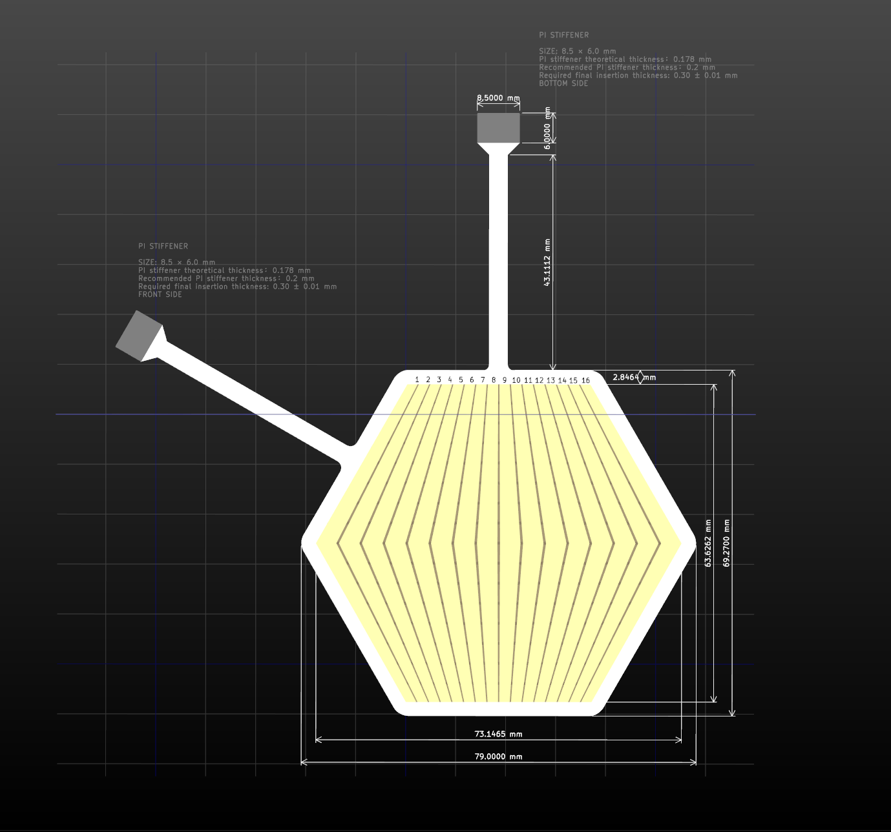

# Flexible FSR array

This directory contains the two-layer flexible FSR electrode carrier used as the replaceable sensing layer in each module.

## Hardware principle

The carrier has two copper electrode layers. One layer routes 16 row electrodes and the other routes 16 perpendicular column electrodes. During assembly, a pressure-sensitive resistive foam layer is placed between the opposing copper surfaces. Compression changes the local resistance at each row-column intersection, producing a 16 x 16 sensing matrix.

The FSR PCB is a passive electrode carrier. It has no local MCU, ADC or multiplexer; the rigid mainboard supplies the row drive and reads the columns. Separate row and column FFC tails connect the carrier to the mainboard.

## Hardware views

### Rendering

### Schematic

### PCB layout

### Manufacturing view

## Principal parts

| Function | Part or record | Quantity |
|---|---|---:|
| Row electrode set | 16 copper electrodes on one flex layer | 1 set |
| Column electrode set | 16 perpendicular copper electrodes on the other flex layer | 1 set |
| Row/column tails | AFC01-S16FCA-00_FPC_TAIL | 2 |
| Connector symbol/footprint record | FPC-05F-16PH20 | 1 |
| Active sensing material | Pressure-sensitive resistive foam, assembled between the copper layers | 1 layer |

The resistive foam is an assembly material and is not represented as a discrete IC on the PCB BOM.

## Design and manufacturing records

- [KiCad project](design/FSR-array.kicad_pro)
- [Schematic source](design/FSR-array.kicad_sch)
- [PCB source](design/FSR-array.kicad_pcb)
- [Design rules](design/FSR-array.kicad_dru)
- [Gerber archive](manufacturing/gerber.zip)
- [Gerber files](manufacturing/gerber)