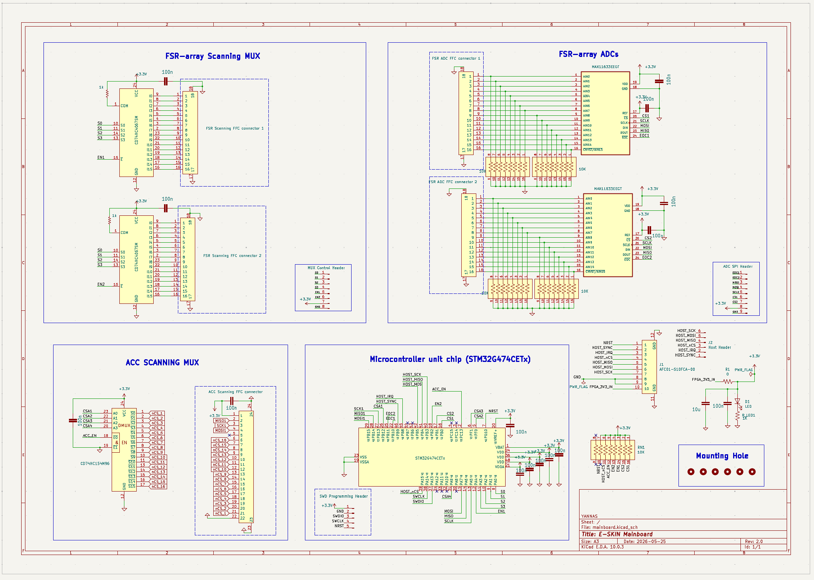
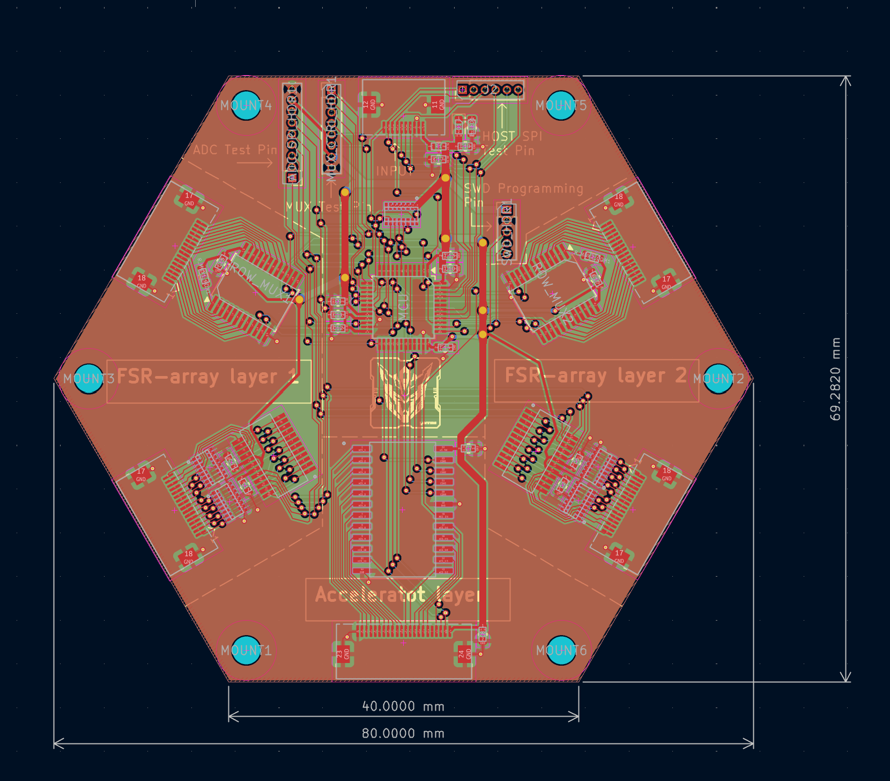
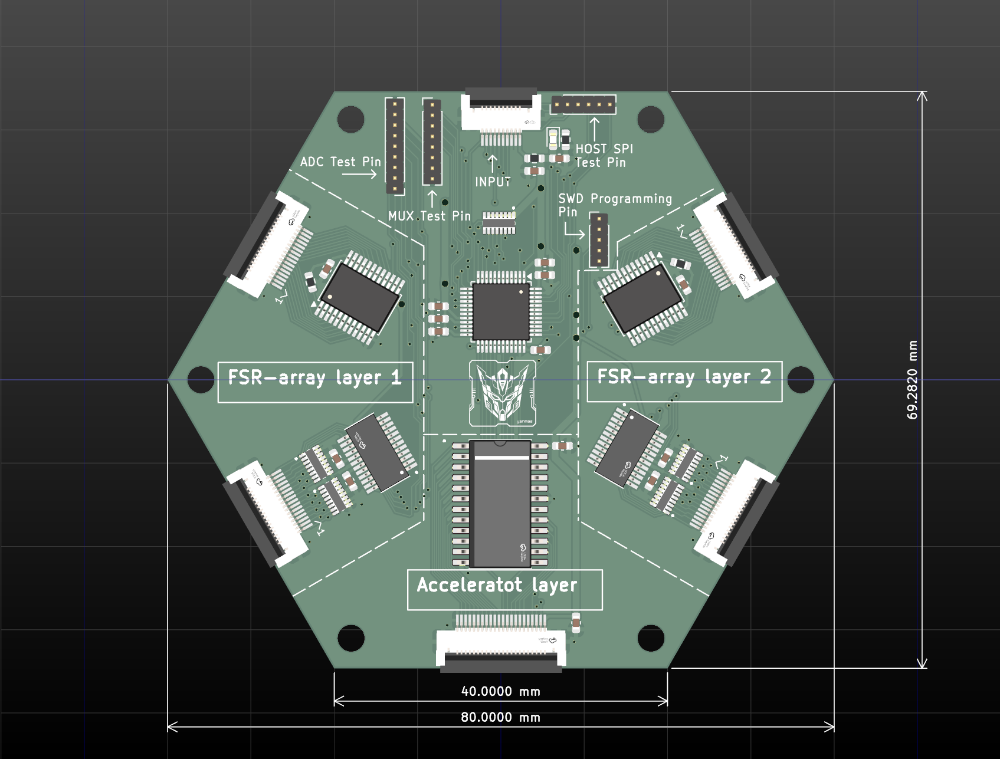
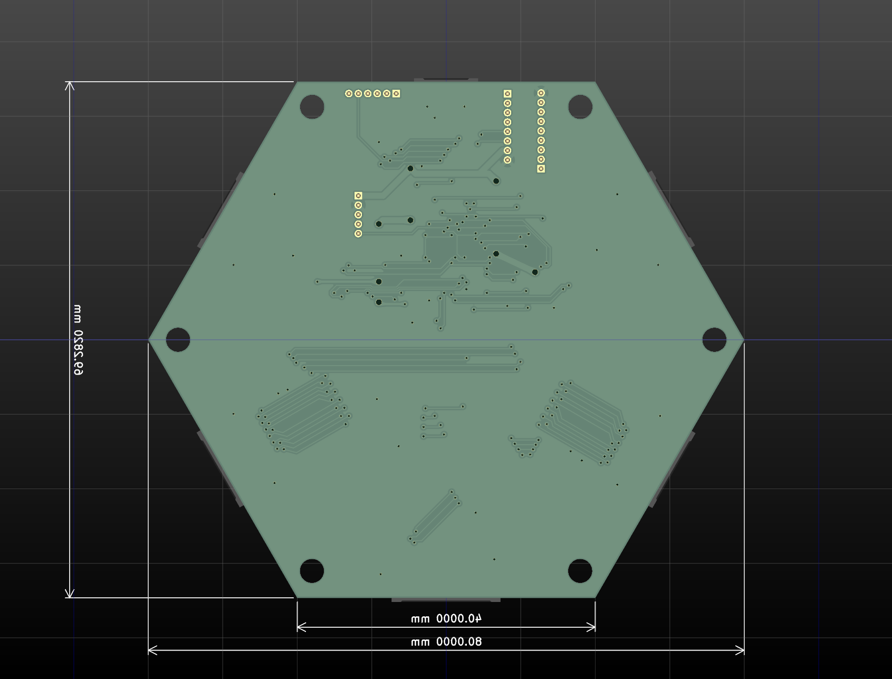

# Mainboard

The mainboard is the current four-layer rigid FR4 controller board for one sensing module. It connects two replaceable FSR layers, performs local readout and ADC conversion, provides branch power and exposes programming, test and host interfaces.

## Hardware principle

The STM32G474CETx controls the local scan. Two CD74HC4067SM multiplexers select the FSR row paths, while two MAX11633EEGT ADCs sample the column paths. The controller buffers the two 16 x 16 matrices and emits an ESKF FULL or ESKD DELTA module frame. FSR row and column signals use separate FFC connectors; the ACC connector and decoder are retained as an interface for the prototype hardware.

The module is powered through the common regulated 3.3 V branch used in the report measurements. The host bridge selects the module over HOST SPI and receives the encoded module frame.

## Hardware views

### Rendering

### Schematic

### PCB layout

### Fabricated board views

<table>
<tr>
<td> Front</td>
<td> Bottom</td>
</tr>
</table>

## Principal components

| Function | Part or record | Quantity |
|---|---|---:|
| Local controller | STM32G474CETx | 1 |
| FSR column ADC | MAX11633EEGT | 2 |
| FSR row multiplexer | CD74HC4067SM | 2 |
| ACC interface decoder | CD74HC154M96 | 1 |
| FSR row/column FFC connectors | AFC01-S16FCA-00 | 4 |
| Host connector | AFC01-S10FCA-00 | 1 |
| ACC FFC connector | AFC01-S22FCA-00 | 1 |
| Resistor arrays | EXB2HV103JV, 10 kOhm | 5 |
| Decoupling | 100 nF capacitors; 10 uF capacitor | 15; 1 |
| Status indicator | SMD LED | 1 |

The list follows the board BOM; passive values and connector references are retained in the source files.

## Design and manufacturing records

- [KiCad project](design/mainboard.kicad_pro)
- [Schematic source](design/mainboard.kicad_sch)
- [PCB source](design/mainboard.kicad_pcb)
- [SPICE netlist](design/mainboard.cir)
- [BOM](manufacturing/gerber/BOM.csv)

- [Gerber files](manufacturing/gerber)

## Component references

- [STM32G474CE datasheet](../../libraries/datasheet/MAINBOARD/MCU%20(stm32g474ce).pdf)
- [MAX11626–MAX11633 ADC datasheet](../../libraries/datasheet/MAINBOARD/ADC%20(MAX11626-MAX11633).pdf)
- [CD74HC4067 multiplexer datasheet](../../libraries/datasheet/MAINBOARD/MUX%20(cd74hc4067).pdf)
- [AFC01-S16FCA-00 connector datasheet](../../libraries/datasheet/MAINBOARD/connector%20(AFC01-S16FCA-00).PDF)
- [AFC01-S10FCA-00 connector datasheet](../../libraries/datasheet/MAINBOARD/connector%20(AFC01-S10FCA-00).PDF)