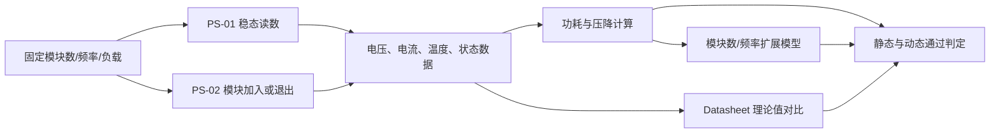

# Power Scalability 评估方法

> **2026-09-07记录覆盖更新：** 当前持续USB接收、FULL、配置200 Hz系列已整理全部15种模块组合的ZERO/MAX电压、电流和温度，共30个配置条件、64条模块支路。详见[完整Power总结](DATA/analysis/current/all_power_review_20260907/README_CN.md)。每个配置条件仍仅一组记录，组合间SD不等于独立重复SD；载荷定义、故障监测与动态验证限制仍保留。旧阻塞待机数据独立作为历史对照，本轮未补测。以下原计划中的重复次数或稳态目标不代表已经执行。

> **2026-09-07当前范围：** 用户确认将启动峰值、供电纹波、负载切换波形和持续温升曲线列为未来工作。本轮Power数据整理与补齐不要求这四项；已有温度仅作为点读数，动态与热稳态验证保持未完成状态。下方原始PS-02方案保留为历史及未来参考，当前执行范围以本说明与 `POWER_REVISION_2.1_CN.md` 为准。

> **2026-09-06 版本说明：** 以下保留原方案与旧分析说明，属于历史方法记录。当前报告2.1采用持续USB接收的ZERO/加载记录，分析入口为 `script/Main/analyze_power_revision.py`，派生结果为 `DATA/reference/analysis_v2_1/`。旧方案中“固定ZERO”、旧拟合和容量数值不作为2.1的当前结论；当前结果、限制和后续工作见 `POWER_REVISION_2.1_CN.md`。

## 1. 为什么 Power Scalability 重要

模块数量增加后，外部 3.3 V 电源需要同时满足更多模块的供电需求。Power Scalability 不仅关注总电流是否增加，还关注电源电压、模块输入电压、功耗、温度和系统运行状态是否仍然可控。

本项目需要分别回答两个问题：

- 在固定模块数量和扫描频率下，系统能否稳定工作；
- 系统运行时加入或退出一个模块，其他健康模块是否受到影响。

第一个问题由 PS-01 稳态实验回答，第二个问题由 PS-02 模块切换事件实验回答。实际采集值统一记录在 [power_raw.csv](DATA/raw/canonical/power_raw.csv) 中；[实验日志](Power_Scalability_Experiment_Log_CN.md) 只记录实验时间线和变更。

> **研究范围声明：** 基于当前硬件设计和 $N\le4$ 的实测结果，外部电源的电流容量余量非常大。本报告固定使用 `FULL`，研究模块数量增加时的供电可扩展性；通过减少扫描量进一步降低功耗的空间稀疏算法暂不在本报告中研究，其算法与功耗收益应在独立的 Data Scalability 评估中验证。

当前评估范围为：

- FSR-only，不使用 ACC；
- 数据模式固定为 `FULL`；
- 单模块频率/负载筛查已覆盖 100 Hz/200 Hz 的 `ZERO` 以及 200 Hz 的 `MAX`；另对 Module 1、2、3 记录固定 200 Hz、`ZERO` 参考值，用于确认模块间基线差异；
- 正式可扩展性实验实测模块数为 $N=2,3,4$，$N>4$ 只进行模型外推；
- 扫描频率固定为 200 Hz；
- 负载固定为 `ZERO`；已完成的 200 Hz 单模块 `ZERO` 与 `MAX` 数据一致，因此不再把负载作为后续扩展实验变量；
- 每个静态条件重复 3 次；
- 模块由外部稳压 3.3 V 供电。

已记录的单模块数据用于确认后续固定条件，不从数据文件中删除。Module 2、3 的参考实验不增加频率/负载筛查，只用于模块间基线比较。正式研究从 $N=2$ 开始，重点观察模块数量增加后的总电流、压降、功耗、温度和运行状态变化。

### 1.1 供电模块

当前实验使用 LM2596 降压模块提供 3.3 V。对应 datasheet 已保存至 [LM2596_datasheet_TI.pdf](../../../hardware/new/docs/datasheet/LM2596_datasheet_TI.pdf)。

| 参数 | Datasheet 值 | 说明 |
|---|---:|---|
| 芯片额定输出电流 | 3 A | LM2596 芯片能力，不等于具体模块的安全连续输出值 |
| 开关峰值限流，25 °C | 3.6 A（最小）/ 4.5 A（典型）/ 6.9 A（最大） | 芯片内部保护限流，不等于模块旋钮的限流设定 |
| 实际模块限流设定 | 待确认 | 必须从模块的 CC 调节、显示或实测结果得到；若模块为 CV-only，则记录为 `NOT_AVAILABLE` |

## 2. Power Scalability 评估方法

### 2.1 实验结构

| 实验 | 目的 | 条件 | 次数 |
|---|---|---|---:|
| PS-01 稳态测量 | 得到模块数量增加时的电压、电流、功耗和稳定温度 | $N=2,3,4$ × 200 Hz × `ZERO`；每个条件重复 3 次 | 9 |
| PS-02 模块切换事件 | 观察运行中加入或退出一个模块对其他模块的影响 | 200 Hz、`FULL`、`ZERO`；6 种转换，每种重复 3 次 | 18 |
| **合计** | 静态与动态模块供电可扩展性 |  | **27** |

PS-01 的 run_id 格式为：

```text
PS01_N{N}_F{f}_{LOAD}_R{r}
```

PS-02 的转换为：

```text
REMOVE: N=2→1、3→2、4→3
ADD:    N=1→2、2→3、3→4
```

对应 run_id 格式为：

```text
PS02_REMOVE_N{N}_F200_ZERO_R{r}
PS02_ADD_N{N}_F200_ZERO_R{r}
```

### 2.2 直接测量量

#### PS-01 稳态测量

| 编号 | 变量 | 测量内容 |
|---|---|---|
| M01 | $V_{\mathrm{source,avg/min/max}}$ | 外部 3.3 V 电源输出端稳定窗口内的平均、最小和最大电压 |
| M02 | $V_{\mathrm{module},i,\mathrm{avg/min/max}}$ | 第 $i$ 个模块输入端稳定窗口内的平均、最小和最大电压 |
| M03 | $I_{\mathrm{source,avg/min/max}}$ | 外部 3.3 V 电源总输出稳定窗口内的平均、最小和最大电流 |
| M04 | $I_{\mathrm{module},i,\mathrm{avg/min/max}}$ | 第 $i$ 个模块供电支路稳定窗口内的平均、最小和最大电流 |
| M05 | $T_{\mathrm{stable}}$ | STM32、稳压器和 Teensy 稳定温度 |
| M06 | `reset` / `current_limit` | 电源、Teensy 和 PC 的状态 |

#### PS-02 动态事件测量

| 编号 | 变量 | 测量内容 |
|---|---|---|
| D01 | $V_{\mathrm{source,pre/post,avg/min/max}}$ | 切换前后的电源稳定窗口平均、最小和最大电压 |
| D02 | $V_{\mathrm{module},i,\mathrm{pre/post,avg/min/max}}$ | 健康模块切换前后的输入电压 |
| D03 | $I_{\mathrm{source,pre/post,avg/min/max}}$ | 切换前后的电源总稳定窗口平均、最小和最大电流 |
| D04 | $I_{\mathrm{module},i,\mathrm{pre/post,avg/min/max}}$ | 健康模块切换前后的支路稳定窗口平均、最小和最大电流 |
| D05 | $V_{\mathrm{event,min}}$、$t_{\mathrm{recovery}}$ | 切换期间最低电压和恢复时间 |
| D06 | `reset` / `current_limit` / `data_gap` | 健康模块和通信状态 |

平均、最小和最大值均来自稳定运行窗口，不包含上电瞬态、浪涌或纹波波形。其他不测量：`T_connector`、`I_host` 和环境温度。

### 2.3 数据流



## 3. 计算与 Evaluation

### 3.1 稳态功耗与压降

外部模块电源不包含 Teensy USB 供电支路。功耗和压降使用稳定窗口的平均值计算：

CSV 中的电流统一以 `mA` 保存；计算功耗时先换算为安培：

$$
I[\mathrm{A}]=\frac{I[\mathrm{mA}]}{1000}
$$

$$
I_{\mathrm{source,avg}}
=\sum_{i=1}^{N} I_{\mathrm{module},i,\mathrm{avg}}
$$

$$
P_{\mathrm{source}}
=V_{\mathrm{source,avg}}I_{\mathrm{source,avg}}
$$

$$
P_{\mathrm{module},i}
=V_{\mathrm{module},i,\mathrm{avg}}I_{\mathrm{module},i,\mathrm{avg}}
$$

$$
\Delta V_i
=V_{\mathrm{source,avg}}-V_{\mathrm{module},i,\mathrm{avg}}
$$

### 3.2 模块切换事件

模块切换事件的电压影响为：

$$
\Delta V_{\mathrm{source,event}}
=V_{\mathrm{source,pre}}-V_{\mathrm{event,min}}
$$

电流变化为：

$$
\Delta I_{\mathrm{source,event}}
=I_{\mathrm{source,post}}-I_{\mathrm{source,pre}}
$$

比较健康模块在切换前后的电压、电流、reset、数据中断和恢复状态。

### 3.3 模块数量模型

由于正式实验固定为 200 Hz、`FULL`、`ZERO`，根据 PS-01 的稳态数据拟合模块数量关系：

$$
I_{\mathrm{source}}(N)
=I_{\mathrm{fixed}}+N I_{\mathrm{module}}
$$

$$
P_{\mathrm{source}}(N)
=V_{\mathrm{source}}I_{\mathrm{source}}(N)
$$

报告固定电流、单模块电流增量、$R^2$、残差和 $N>4$ 的外推结果。

### 3.4 Datasheet 理论值对比

当前 FSR-only 单模块理论电流为：

$$
I_{\mathrm{module,theory}}
=I_{\mathrm{MCU}}+2I_{\mathrm{ADC}}+I_{\mathrm{MUX}}+I_{\mathrm{FSR}}+I_{\mathrm{other}}
$$

$$
I_{\mathrm{source,theory}}
=N I_{\mathrm{module,theory}}
$$

理论–实测误差为：

$$
e_I
=\frac{|I_{\mathrm{meas}}-I_{\mathrm{theory}}|}{I_{\mathrm{theory}}}
$$

`ZERO` 和 `MAX` 分别计算 $I_{\mathrm{FSR}}$，因为 FSR 阻值会随负载变化。

### 3.5 通过条件

| Evaluation | 通过条件 |
|---|---|
| 稳态电压 | 电源端和所有模块端保持在 $3.3\text{ V}\pm5\%$ |
| 稳态供电 | 不触发限流或 brownout，稳定电流保留至少 20% 额定余量 |
| 稳态运行 | 无未解释 reset、掉线或数据停止 |
| 温度 | STM32、稳压器和 Teensy 稳定温度不超过 Datasheet 限制 |
| 模块退出 | 退出一个模块后，健康模块不 reset、不掉线，电压恢复正常 |
| 模块加入 | 加入一个模块后，健康模块不 reset、不掉线，电压恢复正常 |
| 扩展关系 | 固定 200 Hz 时，电流和功耗随 $N$ 的变化可拟合并解释 |
| 理论对比 | 实测电流与 Datasheet 理论值的差异有记录并能解释 |

## 4. 当前源数据分析

### 4.1 数据口径

分析脚本只读取 [power_raw.csv](DATA/raw/canonical/power_raw.csv)，不修改源数据。正式趋势使用
`200 Hz / FULL / ZERO`：$N=1$ 为 Module 0–3 四条独立参考值的汇总，
$N=2,3,4$ 为当前各自的 R1；多模块总平均电流为分别测得的支路平均电流之和。
单模块频率/负载筛查仍保留，用于确认后续固定条件。

| $N$ | 数据数 | $V_{source,avg}$ (V) | $I_{total,avg}$ (mA) | $P_{source}$ (mW) | 最低模块电压 (V) | 最大平均压降 (mV) | 支路电流 CV | 故障数 |
|---:|---:|---:|---:|---:|---:|---:|---:|---:|
| 1 | 4 个模块参考 | 3.281 | 8.353 | 27.405 | 3.263 | 18 | 4.40% | 0 |
| 2 | R1 | 3.280 | 16.267 | 53.356 | 3.262 | 17 | 0.58% | 0 |
| 3 | R1 | 3.279 | 25.179 | 82.562 | 3.262 | 16 | 4.09% | 0 |
| 4 | R1 | 3.275 | 33.134 | 108.514 | 3.220 | 53 | 2.42% | 0 |

### 4.2 固定条件筛查

Module 0 和 Module 1 从 100 Hz `ZERO` 切换到 200 Hz `ZERO`，再切换到
200 Hz `MAX` 后，DMM 记录分辨率内的平均电流和模块电压均未变化。这支持后续
固定为 200 Hz、`FULL`、`ZERO`，但不等同于证明频率和负载永远不影响功耗。


*图 1：两个模块的频率与负载筛查；相同数值为操作者确认的记录，不代表重复测量误差为零。*

### 4.3 电流与功耗扩展

平均总电流拟合为：

\[
I_{total}(N)=8.326N-0.081\ \mathrm{mA},\qquad R^2=0.9994
\]

平均功耗拟合为：

\[
P_{source}(N)=27.25N-0.17\ \mathrm{mW},\qquad R^2=0.9994
\]

当前 $N=1\text{–}4$ 范围内，最大电流拟合残差为 1.87%，说明平均电流和功耗
近似随模块数线性增加。按此模型算术外推到 $N=100$，得到约 0.832 A、2.725 W，
约为 LM2596 芯片 3 A 额定电流的 27.7%；该值没有经过 $N>4$ 实验验证，不能作为
100 模块已可工作的证据。


*图 2：电流与功耗扩展。实测范围与外推区分开显示；$N=1$ 电流误差线为四个不同模块的标准差，$N=2–4$ 暂无重复误差。*

### 4.4 电压与供电分配

电源端平均电压从 $N=1$ 的 3.281 V 降至 $N=4$ 的 3.275 V，只下降 6 mV。
所有模块仍高于 3.135 V 的 $-5\%$ 下限；但 $N=4$ 的 Module 3 最低值仅 3.220 V，
其平均压降达到 53 mV，为当前最大值。这说明当前更明显的扩展风险是支路、连接器
或布线压降，而不是 LM2596 的平均电流容量。


*图 3：电源端与最差模块端电压，相对于完整的设计允许范围。*


*图 4：各供电支路平均压降；灰色短横线表示该模块未参与该组实验，不是零压降。*

### 4.5 支路电流与温度

Module 2 的单模块平均电流为 8.988 mA，比四模块参考中位数 8.152 mA 高 10.3%；
$N=4$ 时 Module 1 为 8.524 mA，比其单模块参考值高 5.0%。两者均需通过 R2/R3
确认是模块差异、支路顺序还是 DMM 重接误差。


*图 5：各模块支路平均电流；四个面板使用相同刻度，点旁直接标出读数。*

STM32 最高记录为 26.3 °C，稳压器最高为 29.3 °C，Teensy 最高为 46.4 °C。
但测量时长未记录，且 Module 1 的历史记录同时出现 `(45.0, 28.9)` 与
`(28.9, 45.0)` 两种稳压器/Teensy 温度排列，因此当前温度图只能观察，不能用于
最终热扩展结论。


*图 6：STM32、稳压器与 Teensy 的温度记录；仅展示观测点，不据此推断热趋势。*

### 4.6 支路最大值求和与异常值

各支路最大值不是同时采集。$N=4$ 的 64.72 mA 是四个独立最大值之和，约为平均
总电流的 1.95 倍，仅作为记录最大值的算术估计，不能写成实测同步峰值，也不能保证
覆盖仪器未捕获的瞬态。


*图 7：平均电流之和与独立记录最大值之和；斜线柱表示非同步估计。*

| 异常或限制 | 当前值 | 含义 |
|---|---:|---|
| Module 3 在 $N=4$ 的输入电压 | 最低 3.220 V；平均压降 53 mV | 仍通过，但应交换线缆/端口并重复，定位供电路径压降 |
| Module 2 单模块电流 | 8.988 mA；比中位数高 10.3% | 当前最大模块间基线差异 |
| Module 1 在 $N=4$ 的支路电流 | 8.524 mA；比单模块高 5.0% | 需要确认支路顺序和复测误差 |
| Teensy 温度 | $N=3$ 为 46.4 °C，$N=4$ 为 42.2 °C | 非单调；测量时长缺失，不能解释为模块数效应 |
| Module 1 温度字段 | `(45.0, 28.9)` / `(28.9, 45.0)` °C | 历史 CSV 中仍有字段对调冲突 |
| 重复次数 | $N=2,3,4$ 均只有 R1 | 尚无重复性和误差范围，当前拟合仅为初步结果 |

当前初步结论：平均电流和功耗在 $N\le4$ 时呈高度线性，未观察到 reset、限流、
brownout 或数据停止；最需要优先复测的是 $N=4$ 的 Module 3 压降。完成 R2/R3、
统一温度测量时长并解决温度字段冲突后，才能形成最终 PS-01 结论并进入 PS-02。

## 5. 输出文件

| 文件 | 内容 |
|---|---|
| [Power_Scalability_Experiment_Log_CN.md](Power_Scalability_Experiment_Log_CN.md) | 实验和文档变更时间线 |
| [power_raw.csv](DATA/raw/canonical/power_raw.csv) | 不修改的原始测量数据 |
| [图表目录](DATA/analysis/figures/README.md) | 7 张图的高清 PNG 与 PDF/SVG 矢量版 |
| [figure_manifest.json](DATA/analysis/figures/figure_manifest.json) | 图表来源、校验值、环境版本与测量限制 |
| [power_summary.csv](DATA/analysis/power_summary.csv) | 每个已选 run 的派生指标 |
| [power_scaling.csv](DATA/analysis/power_scaling.csv) | 按模块数汇总、电流/功耗拟合与残差 |
| [branch_summary.csv](DATA/analysis/branch_summary.csv) | 各模块支路电流、功耗和压降 |
| [thermal_summary.csv](DATA/analysis/thermal_summary.csv) | 当前温度汇总及数据完整性 |
| [anomaly_summary.csv](DATA/analysis/anomaly_summary.csv) | 异常值、限制和建议复测项 |
| [analysis_summary.json](DATA/analysis/analysis_summary.json) | 完整机器可读分析结果 |
| `dynamic_event_summary.csv` | PS-02 完成后生成 |
| `theory_vs_measured.csv` | 元件 Datasheet 理论电流模型完成后生成 |

分析与图表可由 [analyze_power_scalability.py](script/Main/analyze_power_scalability.py)
重新生成；目录说明见 [README.md](README.md)。
